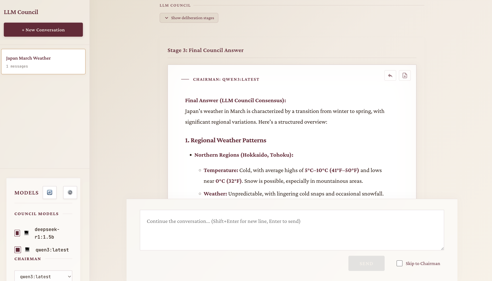

# LLM Council



The idea of this repo is that instead of asking a question to your favorite LLM provider (e.g. OpenAI GPT 5.1, Google Gemini 3.0 Pro, Anthropic Claude Sonnet 4.5, xAI Grok 4, etc.), you can group them into your "LLM Council". This repo is a simple, local web app that essentially looks like ChatGPT except it uses multiple LLM providers to send your query to multiple LLMs, it then asks them to review and rank each other's work, and finally a Chairman LLM produces the final response.

**Supported Providers:**
- **OpenRouter** (cloud) — Access frontier models like GPT-4, Claude, Gemini, Grok
- **Ollama** (local) — Run open-source models locally for free
- **Custom API** — Connect any OpenAI-compatible endpoint

Mix and match models from different providers in the same council!

In a bit more detail, here is what happens when you submit a query:

1. **Stage 1: First opinions**. The user query is given to all LLMs individually, and the responses are collected. The individual responses are shown in a "tab view", so that the user can inspect them all one by one.
2. **Stage 2: Review**. Each individual LLM is given the responses of the other LLMs. Under the hood, the LLM identities are anonymized so that the LLM can't play favorites when judging their outputs. The LLM is asked to rank them in accuracy and insight.
3. **Stage 3: Final response**. The designated Chairman of the LLM Council takes all of the model's responses and compiles them into a single final answer that is presented to the user.

## Features

### Hybrid Provider Mode
- Mix local Ollama models with cloud OpenRouter models in the same council
- Auto-detection of provider based on model name
- Configure all providers from a single "Model Manager" UI

### Ollama Integration (Local Models)
- Auto-detect installed Ollama models via HTTP API
- Browse recommended model families with specific version tags
- Install/uninstall models directly from the UI with real-time streaming logs
- Zero cost — run models on your own hardware

### OpenRouter Integration (Cloud Models)
- Access to frontier models (GPT-4, Claude, Gemini, Grok, etc.)
- Configure API key directly in the UI
- Pay-per-use via OpenRouter credits

### Custom API Support
- Connect any OpenAI-compatible endpoint (LM Studio, vLLM, etc.)
- Optional API key authentication
- Add custom models to your council

### Streaming Responses
- Real-time SSE streaming for all three stages (first opinions, reviews, final response)
- Progressive UI updates as each model responds
- Per-conversation loading state — switch conversations while streaming continues in the background
- Sidebar spinner indicator for conversations with active streams

### Conversation Management
- Create, delete, and switch between multiple conversations
- Automatic title generation based on conversation content
- Persistent storage in JSON files
- Reply to specific messages for focused follow-ups
- Export conversations to PDF

### Context Summarization
- Preserves recent assistant responses (up to 10-message window) as full context
- Automatically summarizes older conversation history to stay within token limits
- Summary metadata displayed in UI so users can distinguish compacted prior context

### Error Handling & Recovery
- Messages interrupted by page reload are automatically marked as failed
- Retry failed messages with a single click (retry button)
- Edit and resubmit failed messages (edit button)
- Old failed/pending messages are auto-cleaned on new submissions

### Skip to Chairman Mode
- Toggle to bypass Stage 1 & 2 and send queries directly to the Chairman model
- Useful for quick responses without the full council deliberation

### Modern UI
- Clean, responsive design with a parliament/council aesthetic
- Collapsible stage views for first opinions and reviews
- Markdown rendering for all responses
- Pill-style model toggles for easy selection
- Hover effects, subtle shadows, and clear destructive action styling

## Quick Start

### 1. Install Dependencies

The project uses [uv](https://docs.astral.sh/uv/) for Python package management.

```bash
# Backend
uv sync

# Frontend
cd frontend && npm install && cd ..
```

### 2. Start the Application

```bash
./start.sh
```

Then open http://localhost:5173 in your browser.

### 3. Configure Your Models

Click the **⚙️ gear icon** next to "Models" in the sidebar to open the Model Manager.

**For Local Models (Ollama):**
1. Go to the **Local** tab
2. Installed models appear automatically (if Ollama is running)
3. Click models to add/remove them from your council
4. Use "Install" to download recommended models

**For Cloud Models (OpenRouter):**
1. Go to the **OpenRouter** tab
2. Enter your API key from [openrouter.ai](https://openrouter.ai/)
3. Click "Save" to validate and load available models
4. Click models to add them to your council

**For Custom APIs:**
1. Go to the **Custom** tab
2. Enter your API URL (e.g., `http://localhost:1234/v1`)
3. Add API key if required
4. Click "Save" to connect

### 4. Select a Chairman

In the sidebar under "Chairman", select which model will synthesize the final response.

## Environment Variables (Optional)

Create a `.env` file in the project root for advanced configuration:

```bash
# OpenRouter (can also be configured in UI)
OPENROUTER_API_KEY=sk-or-v1-...

# Ollama settings
USE_OLLAMA=true
OLLAMA_API_URL=http://localhost:11434
OLLAMA_USE_CLI=true  # Enable install/uninstall from UI

# Custom API (can also be configured in UI)
CUSTOM_API_URL=http://localhost:1234/v1
CUSTOM_API_KEY=optional-key
```

## Running Manually

If you prefer not to use the start script:

**Terminal 1 (Backend):**
```bash
uv run python -m backend.main
```

**Terminal 2 (Frontend):**
```bash
cd frontend
npm run dev
```

## Tech Stack

- **Backend:** FastAPI (Python 3.10+), async httpx, SSE streaming
- **Frontend:** React 18 + Vite, react-markdown for rendering
- **Storage:** JSON files in `data/conversations/`
- **Package Management:** uv for Python, npm for JavaScript
- **LLM Providers:** OpenRouter API, Ollama HTTP API, OpenAI-compatible APIs

## Screenshots

Below are a few screenshots of the app. Images are stored under `.github/screenshots/` to avoid bloating the main repo tree.

- **Conversation:**

	

- **Model Management:**

	

- **Local Ollama models:**

	
